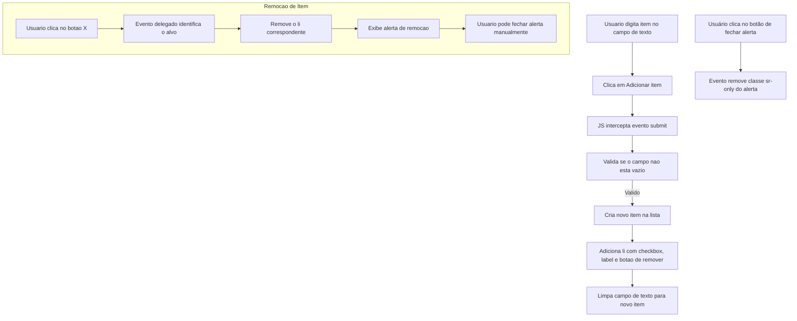

# QuickList - Lista de Compras

## Descrição da aplicação

QuickList é uma aplicação web simples que permite ao usuário adicionar e remover itens de uma lista de compras de forma dinâmica.

### Funcionalidades

- Adicionar novos itens à lista.
- Marcar itens como concluídos (checkbox).
- Remover itens específicos da lista.
- Exibir alerta quando um item é removido.
- Fechar alerta manualmente.

### Estrutura HTML

- `<form>`: Formulário para adicionar novos itens.
- `<ul class="list">`: Lista que armazena os itens.
- `<div id="alert">`: Alerta que é exibido ao remover um item.

### Fluxo da aplicação



### Pontos importantes do código JS

1. **Contador `idItemList`**: garante IDs únicos para cada checkbox.
2. **Função `addNewListItem(value)`**:

   - Cria dinamicamente `<li>`, `<input>`, `<label>` e `<button>`.
   - Adiciona atributos e classes para acessibilidade e estilo.
   - Adiciona o item na lista usando `appendChild`.

3. **Delegação de eventos para remoção**:

   - Evita criar listeners individuais para cada botão.
   - Verifica se o alvo do clique é um botão de deletar.
   - Remove apenas o `<li>` correspondente.

4. **Alertas**:

   - Mostra quando um item é removido.
   - Pode ser fechado manualmente.

5. **Validação de input**:

   - Evita criar itens vazios.
   - Limpa o campo após adicionar.

### Tecnologias utilizadas

- HTML5
- CSS3 (classes já definidas no Figma)
- JavaScript (ES6+)

### Estrutura de arquivos

```
index.html
assets/
  css/index.css
  scripts/script.js
```

### Observações

- O layout e as classes seguem o Figma fornecido.
- A lógica de adição e remoção de itens é totalmente controlada pelo JavaScript.
- Delegação de eventos torna o código escalável para qualquer quantidade de itens.
